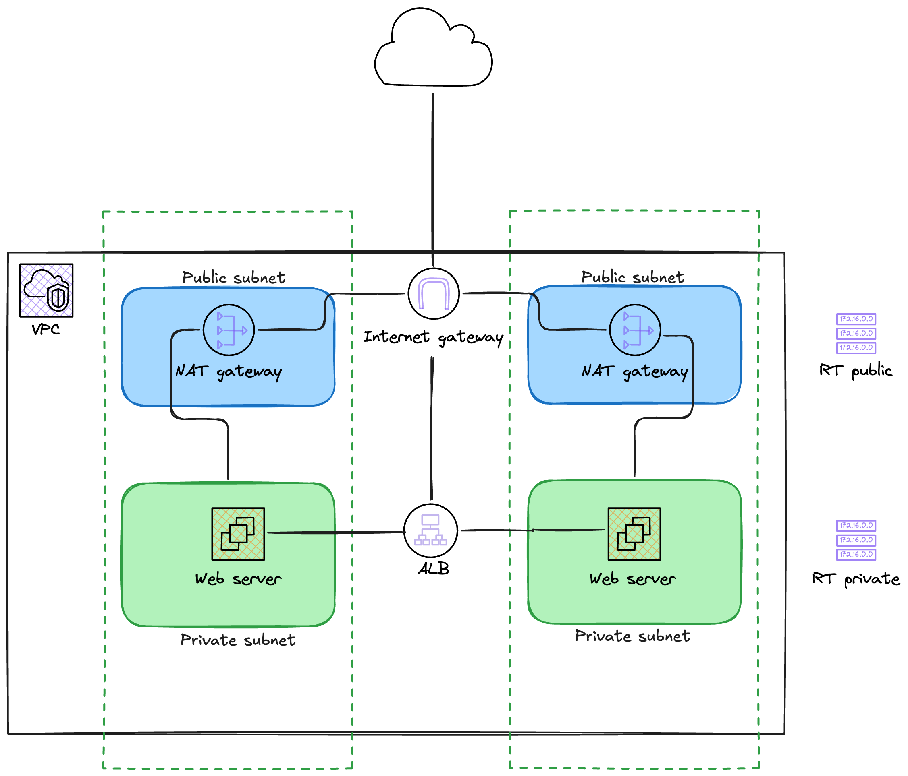

# Actuación en Clase - 2
## Consigna

Encontrar los errores en el código de Terraform y corregirlos. El código deberá desplegar la siguiente arquitectura:

## Definición de terminado

El resultado debe ser la visualización del sitio web (de ambos servidores web) accediendo desde la url del LoadBalancer obtenida del OUTPUT. 